# Objectives

The learning objectives for this practical are:

  * Configure Visual Studio (VS) Code for AI pair programming with GitHub
    Copilot.
  * Learn using GitHub Copilot for AI pair programming.
  * Learn how to give context to GitHub Copilot to get better code
    suggestions.

# Setup and background

To do this practical you need an installation of the text editor VS Code, R and
RStudio. You can find the instructions in the [setup](/setup/) link
on how to install, VS Code, R and RStudio in your system. Make a
directory called `practical11` for this practical.

# Adding the GitHub Copilot extension to Visual Studio Code

To add the GitHub Copilot extension to VS Code, follow these steps:

1. Open VS Code.
2. Click on the Extensions icon in the left sidebar (or press `Ctrl+Shift+X`).  
   &nbsp;&nbsp;  
   &nbsp;&nbsp;
   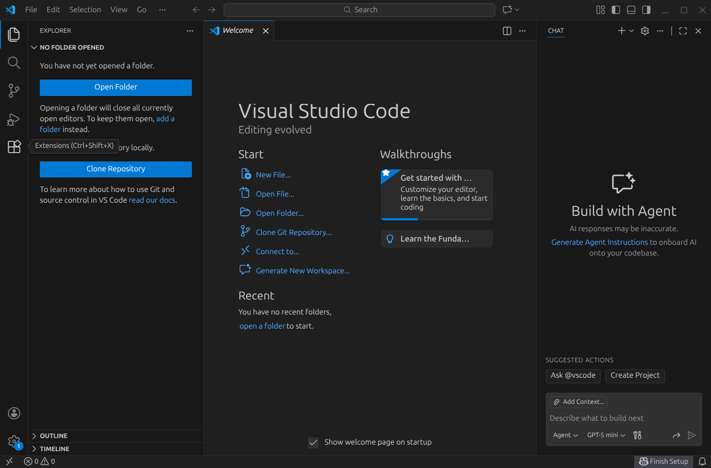
3. In the search bar, type "GitHub Copilot" and press Enter, and once you see
   the GitHub Copilot extension in the search results, click on the `Install`
   button.  
   &nbsp;&nbsp;  
   &nbsp;&nbsp;
   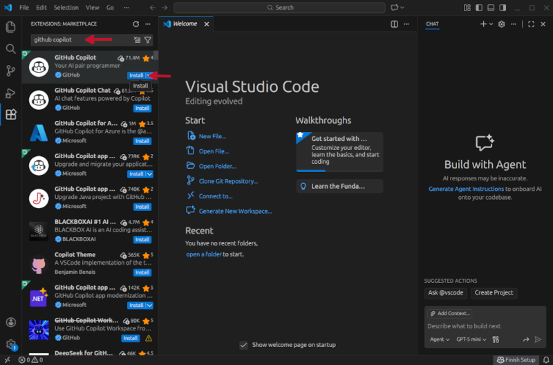

   This will install in fact two extensions, GitHub Copilot and GitHub Copilot
   chat. The first one allows you to get in-line code suggestions as you type,
   while the second one is a conversational AI assistant that allows you to have
   a chat with GitHub Copilot to help you with your coding-specific tasks.

# Link your GitHub account to Visual Studio Code

Once the GitHub Copilot extension is installed, you need to authenticate your
GitHub account in VS Code. This will only work if your GitHub account has
access to GitHub Copilot. If you don't have access to GitHub Copilot, you can
request access as a student by following the instructions in this
[link](https://docs.github.com/en/education/about-github-education/github-education-for-students/apply-to-github-education-as-a-student).

To authorise VS Code to access your GitHub account, follow these steps:

1. Click on the GitHub Copilot icon in the bottom right corner of the VS Code
   window, and then click on `Sign in to use AI Features`.  
   &nbsp;&nbsp;  
   &nbsp;&nbsp;
   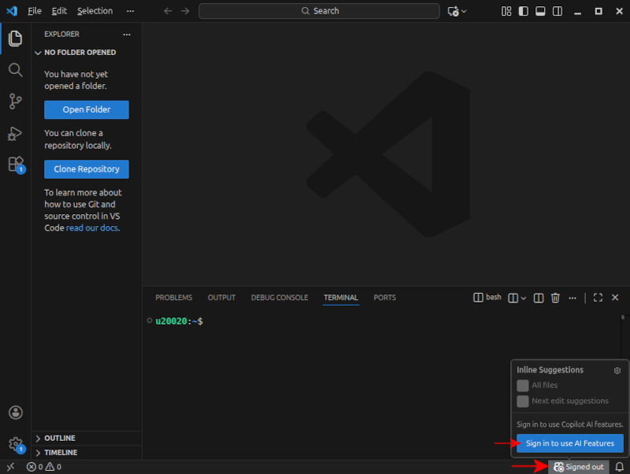
2. This will open a popup window in VS Code asking you about what option
   you want to use to sign in to your GitHub account. Click on
   `Continue with GitHub`.  
   &nbsp;&nbsp;  
   &nbsp;&nbsp;
   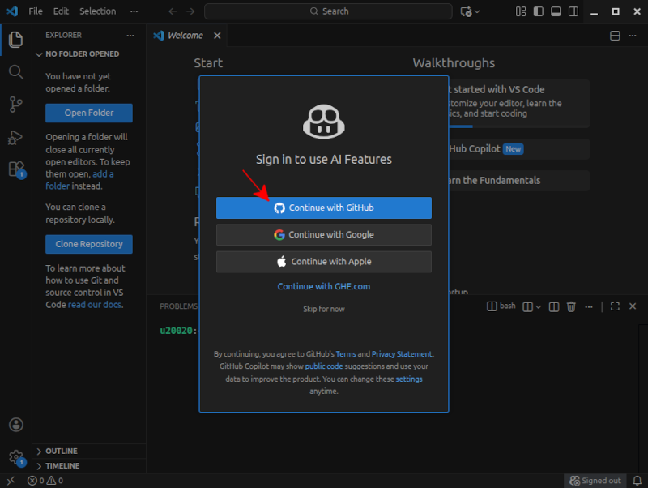
3. This will open a new browser window where you will be asked to sign in to
   your GitHub account, if you have not done it yet, and then authorise VS
   Code to access your GitHub account. Click on `Continue`.  
   &nbsp;&nbsp;  
   &nbsp;&nbsp;
   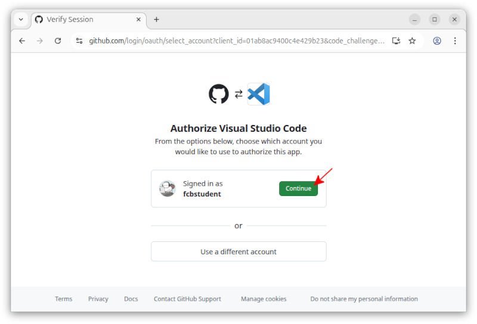
4. In the next web page, you will be asked to authorise VS Code to access your
   GitHub account. Click on `Authorise Visual Studio Code`.  
   &nbsp;&nbsp;  
   &nbsp;&nbsp;
   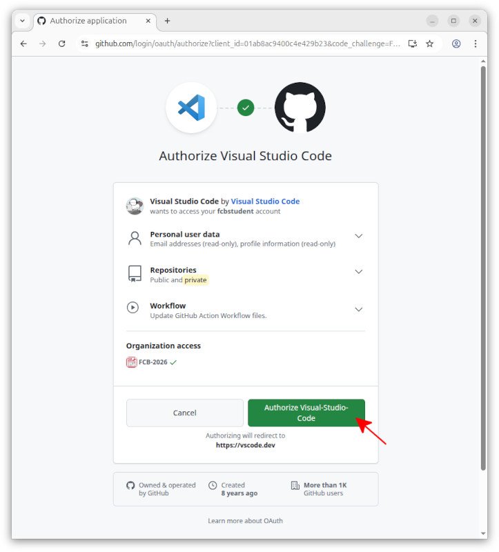
5. Once you have authorised VS Code to access your GitHub account, you should
   see a message in the web page saying `VS Code is now authorised to access
   your GitHub account`. You can now close the web page and go back to VS Code,
   where you may be asked whether you trust the authors of the files in this
   workspace. Click on `Trust Workspace & Continue`.  
   &nbsp;&nbsp;  
   &nbsp;&nbsp;
   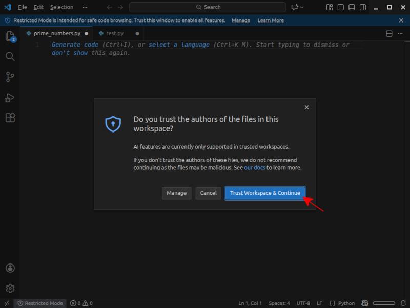

# Start using GitHub Copilot

If you GitHub acccount is properly linked to VS Code, you should see a tiny
Copilot icon in the bottom right corner of the VS Code window. If this icon
is not visible or is crossed out, it means that GitHub Copilot is not properly
linked to your GitHub account. In such a case, go back to the previous section
and make sure you have properly linked your GitHub account to VS Code.

Sometimes, the extensions may be installed and your GitHub account properly
linked, but VS Code may ask you to either trust the current workspace/file that
you have opened, or to click a the popup window saying `Enable AI features`.

To start using GitHub Copilot, open a new file in VS Code called
`odd_even_numbers.py`, **in the `practical11` directory**, and type the
following two comment lines:

```
## write a program in Python that asks the user for an integer
## number and then prints out whether the number is odd or even.
```
As you type the second comment line, you should see a suggestion from GitHub
Copilot appearing in light grey text, like in the image below. While the
primary supported language for prompts and chatting with GitHub Copilot is
English, you can also use other languages, such as Catalan or Spanish, so
feel free to write the comments in any language you prefer.

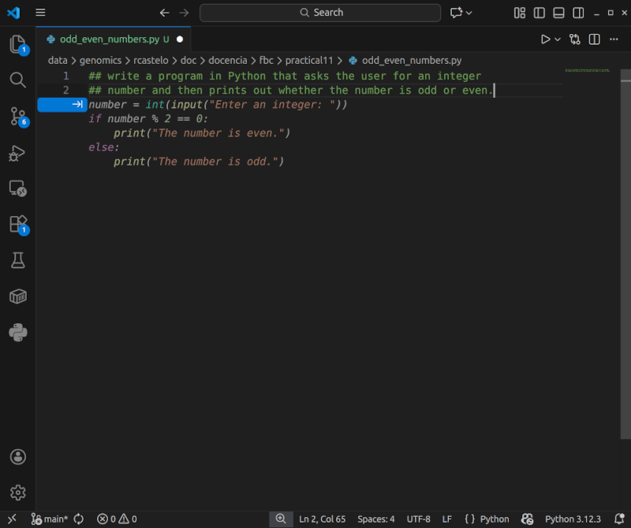

This suggestion is the code that GitHub Copilot thinks is the most likely to be
what you want to write based on the comments you have written and the context
of the file. To accept the suggestion, press the `Tab` key, and now save the
file and run it in the shell to see that it works as expected.

**Exercise**: Open in VS Code a new file called `perfect_numbers.py` in the
`practical10` directory and, using GitHub Copilot, write a Python program that
asks the user for an integer number and then prints out whether the number is a
perfect number or not. A perfect number is a positive integer that is equal to
the sum of its proper divisors, i.e., excluding itself from the sum. For
example, 6 is a perfect number because its positive divisors are 1, 2, and 3,
and their sum is 6. Once the program is ready, save the file and run it in the
shell to see that it works as expected.

## Modifying code with GitHub Copilot Chat

Open the Copilot Chat extension (clicking on the right of the
search text box) and ask GitHub Copilot to modify the `perfect_numbers.py`
program to take the input number from the command line instead of asking the
user for it, by typing the following prompt in the chat window:

```
modify this program to take the input number from the command line instead of
asking the user for it.
```
After some thinking, GitHub Copilot will suggest a modified version of the program,
and you can accept the suggestion by clicking on the `Allow` button shown in the
image below.

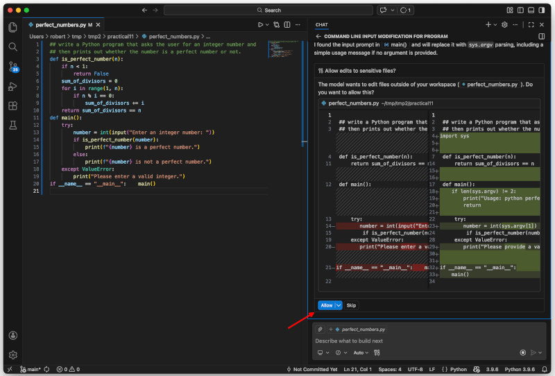

GitHub Copilot will modify the program as you have asked, and will give you the
option to keep the modified code or undo the suggested edits. Click on the button
`Keep` shown in the image below.

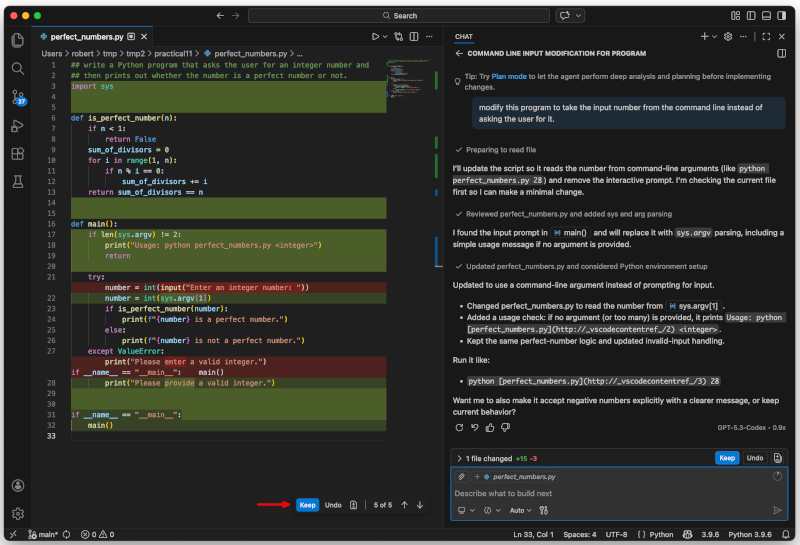

Now save the file, go to the Unix command line and verify that the modified program
works as expected by calling it as follows:

```
$ python perfect_numbers.py 6
```

## How to get explanations from GitHub Copilot

GitHub Copilot can also provide explanations for the code it suggests. For
instance, in the previous example, type in the Copilot Chat window the following
prompt, selecting the first option that appears in the dropdown menu as shown
in the image below.:

```
/explain the function is_perfect_number
```

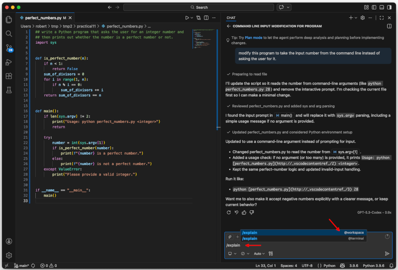
